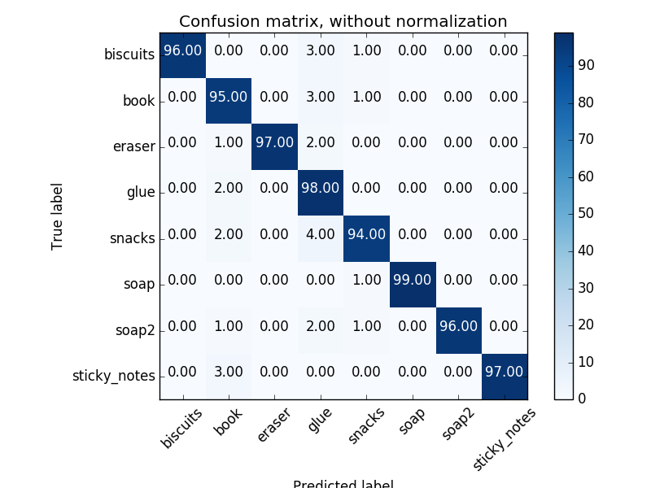
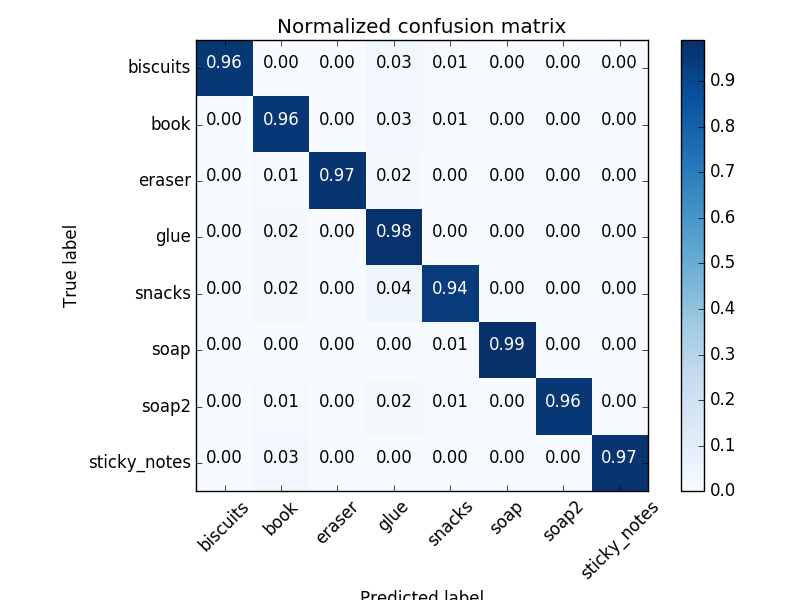
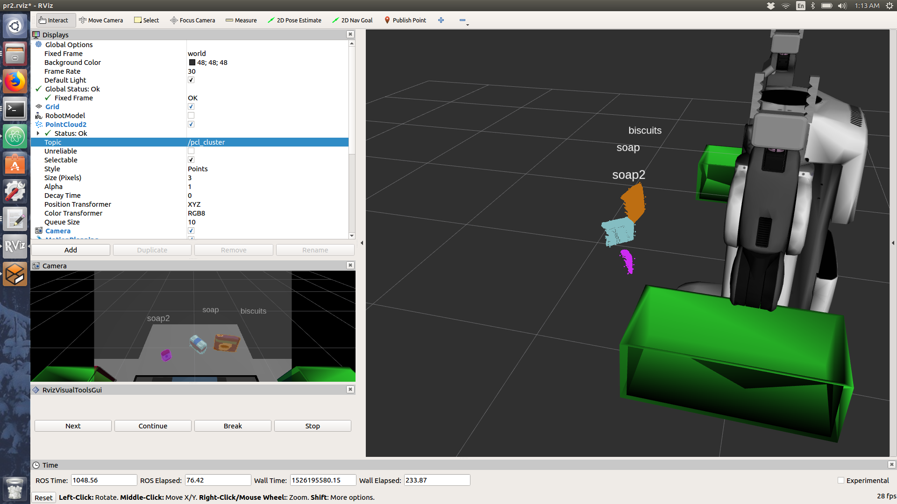
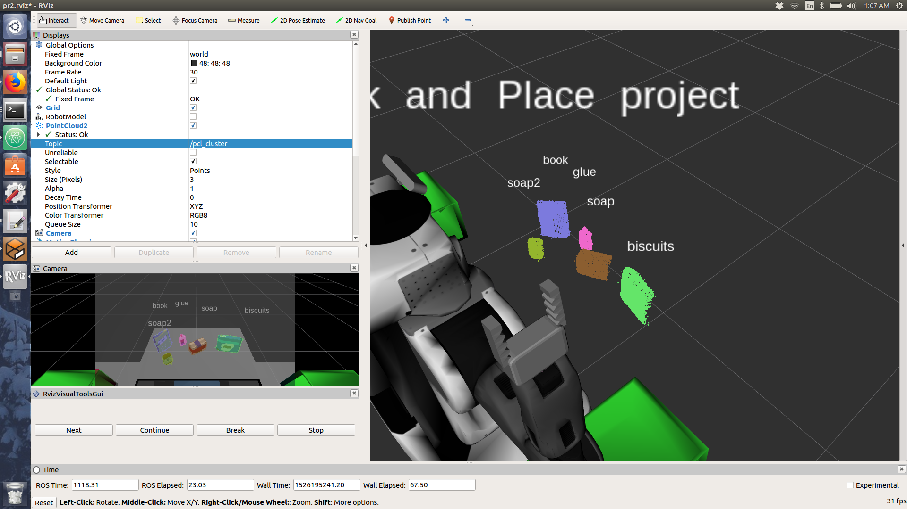
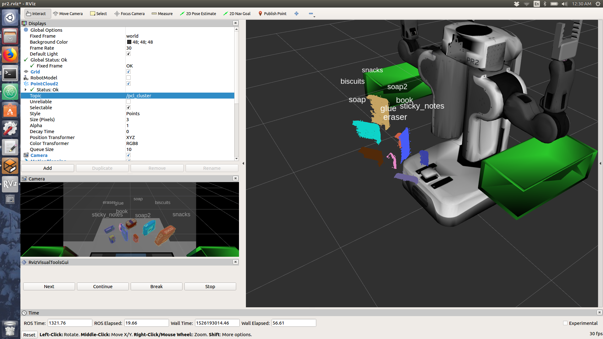

## Project: Perception Pick & Place
### Writeup Template: You can use this file as a template for your writeup if you want to submit it as a markdown file, but feel free to use some other method and submit a pdf if you prefer.

---


# Required Steps for a Passing Submission:
1. Extract features and train an SVM model on new objects (see `pick_list_*.yaml` in `/pr2_robot/config/` for the list of models you'll be trying to identify).
2. Write a ROS node and subscribe to `/pr2/world/points` topic. This topic contains noisy point cloud data that you must work with.
3. Use filtering and RANSAC plane fitting to isolate the objects of interest from the rest of the scene.
4. Apply Euclidean clustering to create separate clusters for individual items.
5. Perform object recognition on these objects and assign them labels (markers in RViz).
6. Calculate the centroid (average in x, y and z) of the set of points belonging to that each object.
7. Create ROS messages containing the details of each object (name, pick_pose, etc.) and write these messages out to `.yaml` files, one for each of the 3 scenarios (`test1-3.world` in `/pr2_robot/worlds/`).  [See the example `output.yaml` for details on what the output should look like.](https://github.com/udacity/RoboND-Perception-Project/blob/master/pr2_robot/config/output.yaml)  
8. Submit a link to your GitHub repo for the project or the Python code for your perception pipeline and your output `.yaml` files (3 `.yaml` files, one for each test world).  You must have correctly identified 100% of objects from `pick_list_1.yaml` for `test1.world`, 80% of items from `pick_list_2.yaml` for `test2.world` and 75% of items from `pick_list_3.yaml` in `test3.world`.
9. Congratulations!  Your Done!

# Extra Challenges: Complete the Pick & Place
7. To create a collision map, publish a point cloud to the `/pr2/3d_map/points` topic and make sure you change the `point_cloud_topic` to `/pr2/3d_map/points` in `sensors.yaml` in the `/pr2_robot/config/` directory. This topic is read by Moveit!, which uses this point cloud input to generate a collision map, allowing the robot to plan its trajectory.  Keep in mind that later when you go to pick up an object, you must first remove it from this point cloud so it is removed from the collision map!
8. Rotate the robot to generate collision map of table sides. This can be accomplished by publishing joint angle value(in radians) to `/pr2/world_joint_controller/command`
9. Rotate the robot back to its original state.
10. Create a ROS Client for the “pick_place_routine” rosservice.  In the required steps above, you already created the messages you need to use this service. Checkout the [PickPlace.srv](https://github.com/udacity/RoboND-Perception-Project/tree/master/pr2_robot/srv) file to find out what arguments you must pass to this service.
11. If everything was done correctly, when you pass the appropriate messages to the `pick_place_routine` service, the selected arm will perform pick and place operation and display trajectory in the RViz window
12. Place all the objects from your pick list in their respective dropoff box and you have completed the challenge!
13. Looking for a bigger challenge?  Load up the `challenge.world` scenario and see if you can get your perception pipeline working there!

## [Rubric](https://review.udacity.com/#!/rubrics/1067/view) Points
### Here I will consider the rubric points individually and describe how I addressed each point in my implementation.  

---
### Writeup / README

#### 1. Provide a Writeup / README that includes all the rubric points and how you addressed each one.  You can submit your writeup as markdown or pdf.  

You're reading it!

### Exercise 1, 2 and 3 pipeline implemented
#### 1. Complete Exercise 1 steps. Pipeline for filtering and RANSAC plane fitting implemented.

* Outlier filter mean k, and scale factors were set to 30 and 0.5 respectively to get rid of most of the noise in the point cloud.

* A leaf size of 0.01 from the lesson look to be too low of a resolution, so I decided to decrease the leaf size to 0.005. Increasing the point cloud density didn't seem to affect processing speed.

* Volume filtering on the y, and z axes was done through trial and error to find the limits.

```Python
# Create a PassThrough filter object.
passthrough = cloud_filtered.make_passthrough_filter()
# Assign axis and range to the passthrough filter object.
filter_axis = 'y'
passthrough.set_filter_field_name(filter_axis)
axis_min = -0.5
axis_max = 0.5
passthrough.set_filter_limits(axis_min, axis_max)
# Finally use the filter function to obtain the resultant point cloud.
cloud_filtered = passthrough.filter()

# Assign axis and range to the passthrough filter object.
passthrough = cloud_filtered.make_passthrough_filter()
filter_axis = 'z'
passthrough.set_filter_field_name(filter_axis)
axis_min = 0.6
axis_max = 1.3
passthrough.set_filter_limits(axis_min, axis_max)
# Finally use the filter function to obtain the resultant point cloud.
cloud_filtered = passthrough.filter()
```

* The distance threshold for the RANSAC plane segmentation was not changed from the lesson, and seemed to work accuretly for this instance as well.

```Python
max_distance = 0.01
seg.set_distance_threshold(max_distance)
```

#### 2. Complete Exercise 2 steps: Pipeline including clustering for segmentation implemented.  

* Clustering threshold values had to be changed from the lesson in order for proper segemenation of the obects. Values were chosen by trial an error.

```Python
ec.set_ClusterTolerance(0.015)
ec.set_MinClusterSize(30)
ec.set_MaxClusterSize(3000)
```


#### 3. Complete Exercise 3 Steps.  Features extracted and SVM trained.  Object recognition implemented.

* Feature detection script for computing histograms of the object's hsv map and normals can be found in ./pr2_robot/scripts/features.py.
* HSV histograms were computed as:

```Python
h_hist = np.histogram(channel_1_vals, bins=32, range=(0, 256))
s_hist = np.histogram(channel_2_vals, bins=32, range=(0, 256))
v_hist = np.histogram(channel_3_vals, bins=32, range=(0, 256))
```
* surface normal histograms were computed as:
```Python
norm_x_hist = np.histogram(norm_x_vals, bins=32, range=(-1, 1))
norm_y_hist = np.histogram(norm_y_vals, bins=32, range=(-1, 1))
norm_z_hist = np.histogram(norm_x_vals, bins=32, range=(-1, 1))
```

* For model training, capturing 100 images for each model gave a good balance for classification accuracy of the SVM vs time to compile the training data.

* Training data with both HSV, and surface normal features was saved as "training_set_hsv_normal.sav". Training data with just the HSV feature was saved as "training_set_hsv.sav".

* a “one-vs-rest” LinearSVC classifier gave better accuracy than the "one-vs-one" SVC using a linear kernal. Experimenting with the non linear kernels did not provide better classification accuracy.

* Feature accuracy of the SVM classifier is shown as:

```
Features in Training Set: 800
Invalid Features in Training set: 1
Scores: [ 0.95625     0.96875     0.9625      0.95625     0.98113208]
Accuracy: 0.96 (+/- 0.02)
accuracy score: 0.962453066333
```


Confusion Matrix             |  Normalized Confusion Matrix
:-------------------------:|:-------------------------:
  |  

### Pick and Place Setup

#### 1. For all three tabletop setups (`test*.world`), perform object recognition, then read in respective pick list (`pick_list_*.yaml`). Next construct the messages that would comprise a valid `PickPlace` request output them to `.yaml` format.


**World 1 result**


**World 2 result**


**World 3 result**
